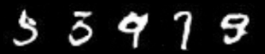
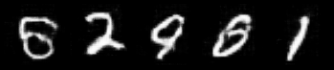

# Convolutional Generative Adversarial Networks 

## Bachelor's Thesis in Computer Engineering (Autonomous University of Barcelona)

    

This project serves as my <a href="https://ddd.uab.cat/pub/tfg/2022/tfg_1637318/Informe_Final.pdf">bachelor's thesis</a>, where I've conducted I an extensive study on <b>Generative Adversarial Networks</b> commonly referred to as GANs.
These versatile models find application in a wide array of domains, from generating ficticious images to enhancing image resolution. The primary focus of this endeavor is the generation of images.  For this I have developed three models:

1. DCGAN (Deep Convolutional GAN): A foundational architecture for image generation.
2. WGAN (Wasserstein GAN): Emplying the Wasserstein distance for stable training.
3. WGAN-GP (Wasserstein GAN with Gradient Penaly): A varinat that further enhances stability.

All of these models were implemented using <b>PyTorch</b> and rigorously trained using both the <a href="https://yann.lecun.com/exdb/mnist">MNIST</a> and <a href="https://mmlab.ie.cuhk.edu.hk/projects/CelebA.html">CelebA</a> (Celebrities Dataset) datasets. In addition to model development and training, I've also incorporated comprehensive evaluation metrics, including the calculation of metrics such as Fréchet Inception Distance (FID), Inception Score (IS), as well as Precision and Recall analyses. This holistic approach ensures a thorough examination of the models' performance and their ability to generate high-quality images."
 

This repository houses all the code developed for model implementations, evaluation metrics, detailed results, and the pretrained Generator models achieved through each training iteration. Dive into this repository to explore the intricate world of GANs and witness the outcomes of this exciting research journey.

## Results
Both the FID, IS and Precision/Reacall have been calculated with 1k generated images.
|Model          |Dataset|Inception Score|FID  |Precision / Recall |
|--------------|:-----:|:--------------:|:---:|:----------:|
|DCGAN          |MNSIT 70k |2.13|49.54|0.08 / 0.10|
|DCGAN          |CELEBA 70k|2.38|51.40|0.50 / 0.11|
|WGAN           |MNSIT 70k |2.16|54.72|0.07 / 0.17|
|WGAN           |CELEBA 70k|2.17|58.66|0.50 / 0.07|
|WGAN-GP        |MNSIT 70k |2.29|63.52|0.05 / 0.05|
|WGAN-GP        |CELEBA 70k|2.28|77.44|0.37 / 0.06|

## Examples of Images Generated

    

        <h4>DCGAN</h4>
        
        
    

    

        <h4>WGAN</h4>
        
        
    

    

        <h4>WGAN-GP</h4>
        
        
    

As you can see, the images generated on the WGAN-GP are worse than the ones obtained by the DCGAN, corroborating the results of the metrics.

## 🚧 How to install 🚧
At this time the developed code is in the Jupyter Notebook format, so it is not enabled for installation and use by third parties. Despite this being in progress, you can see the results generated in real time on this <a href="https://statuesque-dieffenbachia-2967c5.netlify.app/">Website</a>.

## Next Steps ⏩
- [ ] Testing on another datasets
- [ ] Use pre-trained Inception-V3 on MNIST and CelebA
- [ ] Use more generated images to calculate the metrics

## Links 🔗

- <a href="https://ddd.uab.cat/pub/tfg/2022/tfg_1637318/Informe_Final.pdf">My Bachelor Thesis</a>
- <a href="https://hilarious-begonia-e14f53.netlify.app/">My Web Personal Portfolio</a>
- <a href="https://statuesque-dieffenbachia-2967c5.netlify.app/">Web to Test the Image Generation</a>
